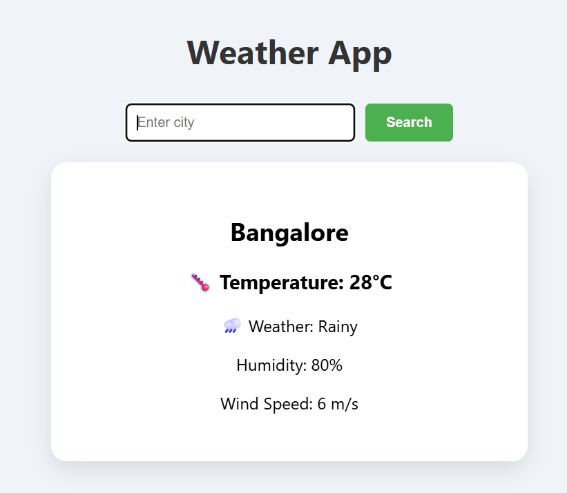

# Experiment 15: Weather App (Local Data)
## Screenshots

Here’s a preview of the app:



 
## 🎯 Objective
To build a **Weather App** in React using:
- Props and state
- Conditional rendering
- Form input handling
- Lists
- Local simulated data (no API)

---

## 🛠️ Steps Followed

1. Created React app:
```bash
npx create-react-app weather-app
```
## Live Demo:-https://react-weatherapp-45.netlify.app/
Deploying in netlify 
```
npm run build
```
